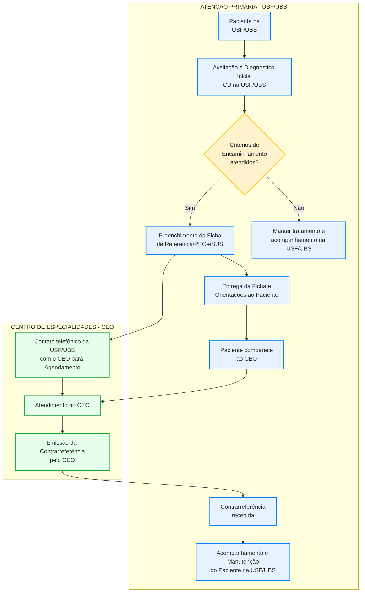

```mermaid
flowchart TD
    %% Definição dos Estilos
    classDef primary fill:#e6f3ff,stroke:#007bff,stroke-width:2px
    classDef ceo fill:#e6ffed,stroke:#28a745,stroke-width:2px
    classDef decision fill:#fff3cd,stroke:#ffc107,stroke-width:2px

    %% Subgrupos para Organização Visual
    subgraph ATENCAO_PRIMARIA["ATENÇÃO PRIMÁRIA - USF/UBS"]
        A["Paciente na<br/>USF/UBS"]
        B["Avaliação e Diagnóstico Inicial<br/>CD na USF/UBS"]
        C{"Critérios de<br/>Encaminhamento<br/>atendidos?"}
        D["Preenchimento da Ficha<br/>de Referência/PEC-eSUS"]
        F["Entrega da Ficha e<br/>Orientações ao Paciente"]
        G["Paciente comparece<br/>ao CEO"]
        J["Contrarreferência<br/>recebida"]
        K["Acompanhamento e Manutenção<br/>do Paciente na USF/UBS"]
        L["Manter tratamento e<br/>acompanhamento na USF/UBS"]

        A --> B
        B --> C
        C -->|Sim| D
        D --> F
        F --> G
        J --> K
        C -->|Não| L
    end

    subgraph CEO["CENTRO DE ESPECIALIDADES - CEO"]
        E["Contato telefônico da USF/UBS<br/>com o CEO para Agendamento"]
        H["Atendimento no CEO"]
        I["Emissão da Contrarreferência<br/>pelo CEO"]

        E --> H
        H --> I
        I --> J
    end

    %% Conexões entre os Subgrupos
    D --> E
    G --> H

    %% Aplicação dos Estilos
    class A,B,D,F,G,J,K,L primary
    class E,H,I ceo
    class C decision
```
